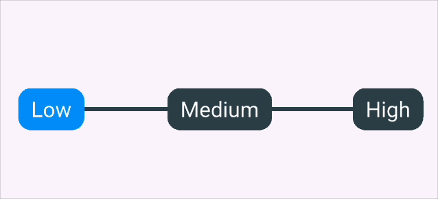

# Discrete Slider

A highly customizable discrete slider (step slider) widget for Flutter applications. Create beautiful step-based sliders with labels and smooth animations.

[](https://pub.dev/packages/discrete_slider)
<!-- [](https://pub.dev/packages/discrete_slider/score)
[](https://pub.dev/packages/discrete_slider/score)
[](https://pub.dev/packages/discrete_slider/score) -->


## Features

- 🎯 **Discrete Steps**: Create sliders with specific number of steps
- 🏷️ **Custom Labels**: Add custom labels for each step
- 🎨 **Highly Customizable**: Customize colors, text styles, padding, and more
- 🎮 **Controller Support**: Programmatically control slider value
- 📱 **Touch Friendly**: Supports both tap and drag gestures
- ⚡ **Lightweight**: Minimal dependencies and optimized performance

## Installation

Add this to your package's `pubspec.yaml` file:

```yaml
dependencies:
  discrete_slider: ^1.0.0
```

Then run:

```bash
flutter pub get
```

## Usage

### Basic Usage

```dart
import 'package:discrete_slider/discrete_slider.dart';

DiscreteSlider(
  steps: 2,
  labels: ["Low", "Medium", "High"],
  onChanged: (value) {
    print("Selected step: $value");
  },
)
```

### With Controller


```dart
class MyWidget extends StatefulWidget {
  @override
  _MyWidgetState createState() => _MyWidgetState();
}

class _MyWidgetState extends State<MyWidget> {
  late DiscreteSliderController _controller;

  @override
  void initState() {
    super.initState();
    _controller = DiscreteSliderController();
  }

  @override
  void dispose() {
    _controller.dispose();
    super.dispose();
  }

  @override
  Widget build(BuildContext context) {
    return Column(
      children: [
        DiscreteSlider(
          controller: _controller,
          steps: 4,
          onChanged: (value) {
            print("Step changed to: $value");
          },
        ),
        ElevatedButton(
          onPressed: () => _controller.moveTo(2),
          child: Text("Move to Step 2"),
        ),
      ],
    );
  }
}
```

### Customized Slider

```dart
DiscreteSlider(
  steps: 6,
  onChanged: (value) {
    print("Selected: $value");
  },
  trackWidth: 10,
  labelTextStyle: TextStyle(
    fontSize: 14,
    fontWeight: FontWeight.bold,
  ),
  inActiveColor: Colors.red.shade300,
  inActiveTrackColor: Colors.grey.shade300,
  activeTrackColor: Colors.red,
  activeColor: Colors.red.shade900,
  labelBorderRadius: 12,
  height: 32,
)
```

## Properties

| Property | Type | Default | Description |
|----------|------|---------|-------------|
| `steps` | `int` | **Required** | Number of steps in the slider |
| `onChanged` | `ValueChanged<int>` | **Required** | Callback when slider value changes |
| `controller` | `StepSliderController?` | `null` | Controller for programmatic control |
| `labels` | `List<String>?` | `null` | Custom labels for each step |
| `labelPadding` | `EdgeInsets?` | `null` | Padding around labels |
| `labelTextStyle` | `TextStyle?` | `null` | Text style for labels |
| `inActiveTrackColor` | `Color?` | `null` | Color of inactive track |
| `activeTrackColor` | `Color?` | `null` | Color of active track |
| `activeColor` | `Color?` | `null` | Color of active step indicator |
| `inActiveColor` | `Color?` | `null` | Color of inactive step indicators |
| `labelBorderRadius` | `double?` | `null` | Border radius for label background |
| `height` | `double` | `28` | Height of the slider |
| `trackWidth` | `double?` | `null` | Width of the track line |

## Controller Methods

### DiscreteSliderController

```dart
DiscreteSliderController controller = DiscreteSliderController();

// Move to specific step
controller.moveTo(3);

// Get current step
int currentStep = controller.currentStep;

// Listen to changes
controller.addListener(() {
  print("Current step: ${controller.currentStep}");
});

// Don't forget to dispose
controller.dispose();
```

## Examples

### Settings Slider

```dart
DiscreteSlider(
  steps: 3,
  labels: ["Off", "Low", "Medium", "High"],
  onChanged: (level) {
    print("Volume level: $level");
  },
  trackWidth: 8,
  height: 40,
  labelBorderRadius: 20,
  activeTrackColor: Colors.green,
)
```

### Progress Indicator

```dart
DiscreteSlider(
  controller: _progressController,
  steps: 5,
  labels: ["Start", "25%", "50%", "75%", "Complete"],
  onChanged: (_) {}, // Read-only in this case
  activeTrackColor: Colors.blue,
  inActiveTrackColor: Colors.grey.shade300,
)
```
### Rating Slider

```dart
DiscreteSlider(
  steps: 4,
  labels: ["Poor", "Fair", "Good", "Great", "Excellent"],
  onChanged: (rating) {
    print("Rating: ${rating + 1} stars");
  },
  activeTrackColor: Colors.amber,
  labelTextStyle: TextStyle(
    fontSize: 16,
    color: Colors.amber.shade700,
  ),
)
```

## Complete Example

```dart
import 'package:flutter/material.dart';
import 'package:discrete_slider/discrete_slider.dart';

class MyHomePage extends StatefulWidget {
  const MyHomePage({super.key, required this.title});

  final String title;

  @override
  State<MyHomePage> createState() => _MyHomePageState();
}

class _MyHomePageState extends State<MyHomePage> {
  DiscreteSliderController _controller = DiscreteSliderController();
  DiscreteSliderController _sliderController = DiscreteSliderController();

  @override
  void dispose() {
    _controller.dispose();
    _sliderController.dispose();
    super.dispose();
  }

  void moveToStep() {
    _controller.moveTo(2);
  }

  @override
  Widget build(BuildContext context) {
    return Scaffold(
      appBar: AppBar(
        backgroundColor: Theme.of(context).colorScheme.inversePrimary,
        title: Text(widget.title),
      ),
      body: Padding(
        padding: const EdgeInsets.all(20.0),
        child: Column(
          children: <Widget>[
            // Basic slider with labels
            Padding(
              padding: const EdgeInsets.symmetric(horizontal: 20),
              child: DiscreteSlider(
                steps: 2,
                labels: ["Low", "Medium", "High"],
                onChanged: (value) {
                  print("Basic slider: $value");
                },
                labelTextStyle: TextStyle(fontSize: 20),
              ),
            ),
            SizedBox(height: 30),
            
            // Customized slider with controller
            DiscreteSlider(
              controller: _controller,
              steps: 4,
              onChanged: (value) {
                print("Controlled slider: $value");
              },
              trackWidth: 20,
              labelTextStyle: TextStyle(fontSize: 20),
              inActiveTrackColor: Colors.grey.shade300,
              activeTrackColor: Colors.grey.shade500,
              labelBorderRadius: 18,
            ),
            SizedBox(height: 30),
            
            // Compact slider
            DiscreteSlider(
              controller: _sliderController,
              steps: 6,
              onChanged: (value) {
                print("Compact slider: $value");
              },
              trackWidth: 10,
              labelTextStyle: TextStyle(fontSize: 14),
              inActiveTrackColor: Colors.grey.shade300,
              activeTrackColor: Colors.blue,
              labelBorderRadius: 12,
            ),
            
            Padding(
              padding: const EdgeInsets.all(20.0),
              child: Row(
                children: [
                  Expanded(
                    child: ElevatedButton(
                      onPressed: moveToStep,
                      child: Text("Move to Step 2"),
                    ),
                  ),
                ],
              ),
            ),
          ],
        ),
      ),
    );
  }
}
```

## License

This project is licensed under the MIT License - see the [LICENSE](LICENSE) file for details.

## Support

If you like this package, please give it a ⭐ on [GitHub](https://github.com/oddbuddy/discrete_slider) and a 👍 on [pub.dev](https://pub.dev/packages/discrete_slider)!

For issues and feature requests, please visit our [GitHub Issues](https://github.com/oddbuddy/discrete_slider/issues) page.